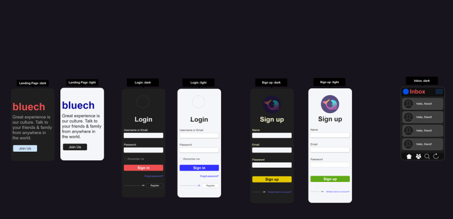

# Bluech-Web

**Bluech-Web** is a client chat-app designed to handle multi users, threaded, and other complex forms of chatting.
The idea is to support media attachments, video & audio calls, text messages, and continuous notifications through its built-in push notification features.
Currently, it only supports text messaging and one-on-one single threaded user chat.

## UIX Templates

<blockquote>
  
</blockquote>

## 🛠️ Built With

### Tools & Methods

## ✍️ Authors

👤 **Steve**

- GitHub: [@sntakirutimana72](https://github.com/sntakirutimana72/)
- LinkedIn: [steve-ntakirutimana](https://www.linkedin.com/in/steve-ntakirutimana/)

## 🤝 Contributing

Contributions, issues, and feature requests are welcome!

Feel free to check the [issues page](../../issues/).

## 🫶 Show your support

Give a ⭐️ if you like this project!

## 🤓 Acknowledgments

- Devs Communities for great free and resourceful articles.

## 📝 License

This project is [MIT](./LICENSE) licensed.
